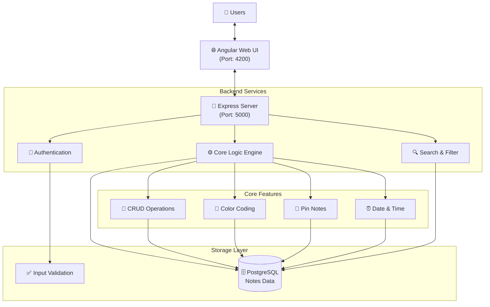

# 📝 Notes Keeper

A modern, full-stack note management application with a beautiful skeuomorphic UI, animated particles, and color-coded organization.

## 🎯 Features

- ✅ Create, read, update, delete notes (CRUD)
- ✅ Pin important notes
- ✅ Color-coded notes (10 colors)
- ✅ Real-time search & filter
- ✅ Responsive design (mobile, tablet, desktop)
- ✅ Date & time tracking
- ✅ Beautiful skeuomorphic design with animations
- ✅ Floating particle animations

## 🏗️ System Architecture



## 🏗️ Tech Stack

**Backend:** Node.js + Express + PostgreSQL  
**Frontend:** Angular 17 + TypeScript + Axios  
**Database:** PostgreSQL 18 with connection pooling

## 🚀 Quick Start

### Backend Setup
```bash
cd backend
npm install
# Create .env file with credentials below
npm start
```
**Server runs on:** `http://localhost:5000`

### Backend .env Configuration
Create `.env` file in `backend/` directory:
```env
# Database Configuration
DB_USER=postgres
DB_PASSWORD=your_secure_password
DB_HOST=localhost
DB_PORT=5432
DB_NAME=notes_app

# Server Configuration
PORT=5000
NODE_ENV=development
```

### Frontend Setup
```bash
cd frontend
npm install --legacy-peer-deps
npm start
```
**App opens on:** `http://localhost:4200`

## 🗄️ Database Setup

```sql
CREATE DATABASE notes_app;

CREATE TABLE notes (
    id SERIAL PRIMARY KEY,
    title VARCHAR(255) NOT NULL,
    content TEXT NOT NULL,
    color VARCHAR(7) DEFAULT '#ffffff',
    is_pinned BOOLEAN DEFAULT false,
    created_at TIMESTAMP DEFAULT CURRENT_TIMESTAMP,
    updated_at TIMESTAMP DEFAULT CURRENT_TIMESTAMP
);
```

## 🔌 API Endpoints

| Method | Endpoint | Description |
|--------|----------|-------------|
| GET | `/notes` | Get all notes |
| POST | `/notes` | Create new note |
| PUT | `/notes/:id` | Update note |
| DELETE | `/notes/:id` | Delete note |

### Example: Create Note
```bash
curl -X POST http://localhost:5000/notes \
  -H "Content-Type: application/json" \
  -d '{"title": "My Note", "content": "Content here", "color": "#f28b82"}'
```

## 🎨 Note Colors

White, Red, Orange, Yellow, Green, Teal, Cyan, Blue, Purple, Pink

## 📱 Responsive Breakpoints

- Desktop: 1200px+
- Tablet: 768px - 1199px
- Mobile: < 768px

## 🛠️ Prerequisites

- Node.js 16+
- PostgreSQL 18+
- npm 9+

## 📚 Project Structure

```
notes-keeper/
├── backend/
│   ├── index.js
│   ├── db/pool.js
│   ├── routes/notes.js
│   └── controllers/notesController.js
└── frontend/
    └── src/app/
        ├── components/
        ├── services/
        └── models/
```

## 🐛 Troubleshooting

**PostgreSQL connection error:** Check `.env` credentials and ensure PostgreSQL is running

**CORS error:** Verify frontend port matches CORS config in backend

**Module errors:** Run `npm install` and restart dev server

## 📄 License

MIT License

---
